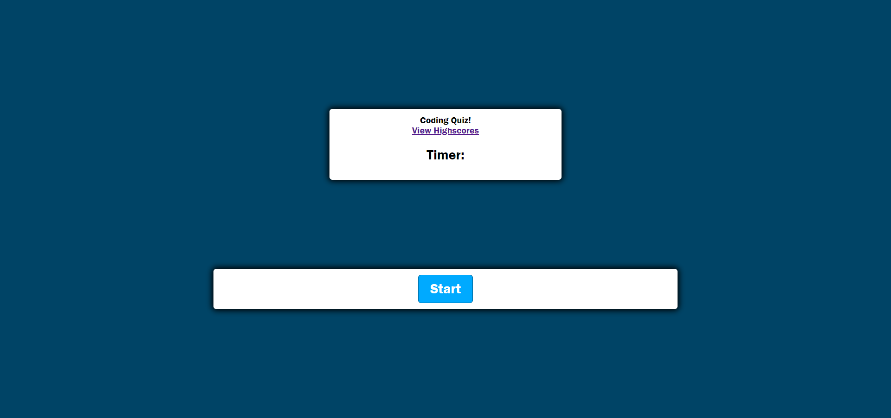

# Web-APIs-Code-Quiz

Code Quiz!

# Created by:

Jackson Barker

# Password Code Quiz

This code quiz will present the user with five questions and determine if the user answer is correct or incorrect. The user will be able to test their knowledge on coding and view their high scores when finished.

# Usage

- The user will be asked to "click" start.
- The first question will be presented and a 60 second timer will start.
- The user will have four choices per question and will be altered if their answer was correct or incorrect by a color change of the back ground and answer choices. 
- After the final question the timer will stop and the user will be asked to enter their entails to be displayed with their high score on the high score page. 

# Link

https://jackson-barker.github.io/Web-APIs-Code-Quiz/

# Screen Shot 

